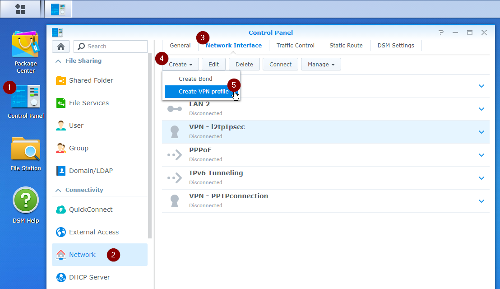
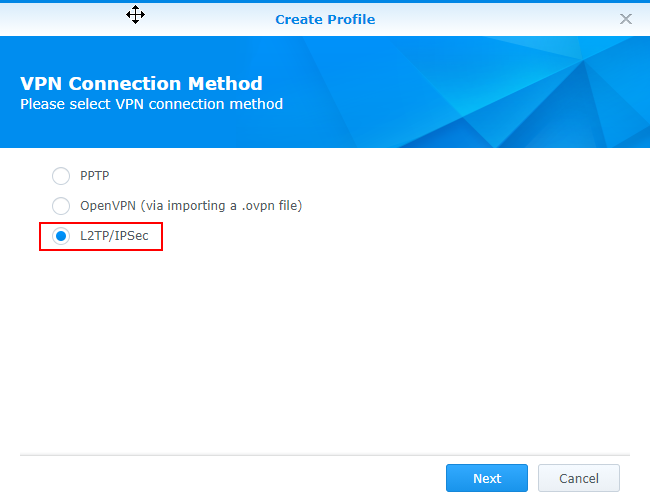
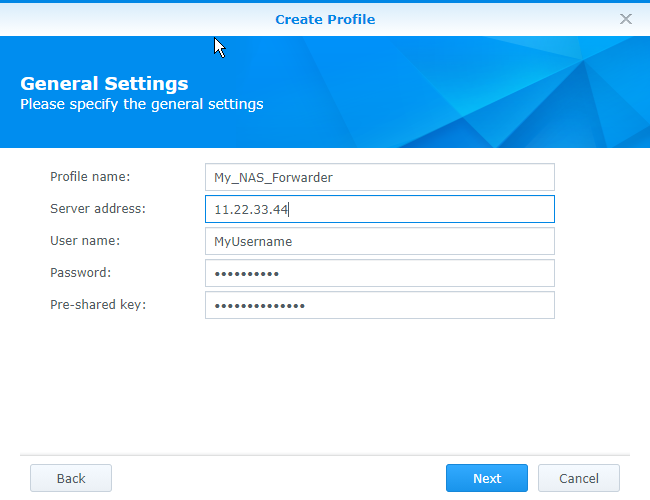
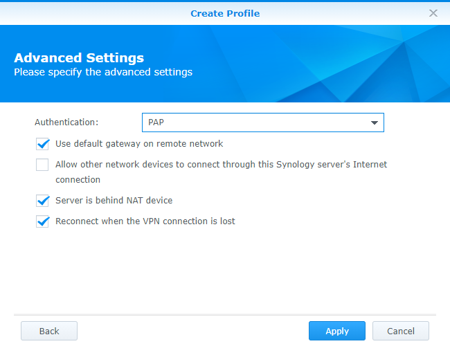
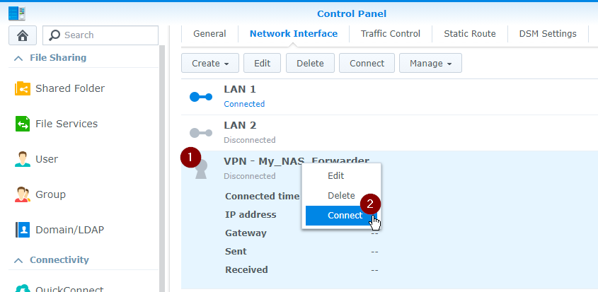
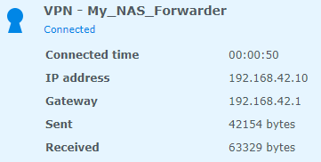
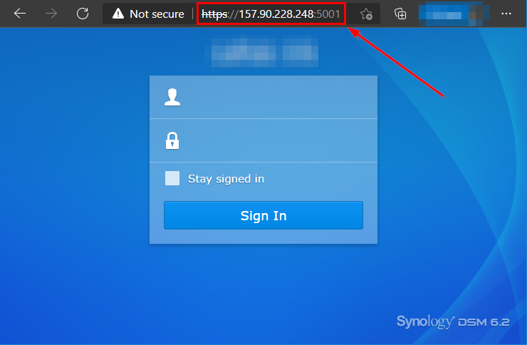

# NAS Forwarder VPN

- Image repository [Dockerhub: mlefkon/nas-forwarder-vpn](https://hub.docker.com/r/mlefkon/nas-forwarder-vpn)

- Source repository [Github: mlefkon/nas-forwarder-vpn](https://github.com/mlefkon/nas-forwarder-vpn)

## **What It Does**

### **ISP Blocking Problem**

You can't connect to your NAS from outside the home if:

- Your ISP blocks some ports.
- Your ISP gives you a private IP address.  
  
  Your home modem is hidden behind the ISP's NAT router. The ISP has a single public IP on one side of the router and many homes' private IPs on the other side.  This is probably the case if the ISP is cellular, but could happen as well with a landline ISP.  ISPs do this to conserve IP addresses.

  To check this:

  - Logon to admin page of your router and check the "Internet Status". Find the IP address.  If it differs from [https://whatismyipaddress.com](https://whatismyipaddress.com) then your IP is private.

Dynamic DNS (DDNS) will not work in either of these situations.

### **VPN Solution**

The problem above only happens to connections started from outside the home. It does not affect connections originating from within your home, ie. your NAS.

So the solution is to have your NAS contact an outside server to start a connection. Further communications are unaffected after the connection is established.

This outside server is an unrestricted VPN server that has a static public IP. Any traffic on any port that it receives can be forwarded to your NAS.

## **Setup** (for Dummies)

1. Sign up with a cloud provider, eg. Hetzner ([20€ coupon](https://hetzner.cloud/?ref=qfeTgy8M0mjf) - full disclosure: affiliate link).

1. Create a cloud server:

    Choose CentOS-7 as the Operating System Image, and the smallest size should suffice.

    You should get an email or notification with an `(IP Address)` and `(root password)`.

1. Sign in

    If using Windows, press (Windows Key)-R and enter: `ssh root@(IP Address)`

    Enter the `(root password)` when asked.

    When prompted, change the given password to one you'll remember.

1. Install docker
  
    Copy/paste this onto the command line:

   ```bash
   yum install -y docker
   systemctl enable docker.service
   systemctl start docker.service
   ```

1. Decide your `(vpn_user_name)`, `(vpn_user_password)` and `(vpn_pre_shared_key)` to be used below.

    Do not use spaces.

    The vpn_user_password and vpn_pre_shared_key are both passwords.  Enter 8-12 characters and make them different.

1. Choose Ports

   Decide what apps you need to access on your NAS and choose the corresponding ports. Service/App/Port lists can be found here: [Synology](https://www.synology.com/en-us/knowledgebase/DSM/tutorial/Network/What_network_ports_are_used_by_Synology_services), [QNap](https://www.qnap.com.cn/en/how-to/faq/article/what-is-the-port-number-used-by-the-turbo-nas), [TrueNAS](https://www.truenas.com/docs/references/defaultports/), [Asustor](https://www.asustor.com/knowledge/detail/?id=6&group_id=601), [NetGear ReadyNAS](https://kb.netgear.com/1166/Port-numbers-for-port-forwarding)

1. Run the VPN Server

    Copy/Paste this code onto the command line substituting (data):

    ```bash
    docker run --name nas-forwarder -d --privileged --restart=always -p 500:500/udp -p 4500:4500/udp \
      -p (1st Port from above):(1st Port from above)/tcp \
      -p (2nd Port):(2nd Port)/tcp \
          etc...
      -p (Last Port):(Last Port)/tcp \
      -e VPN_IPSEC_PSK=(vpn_pre_shared_key) \
      -e VPN_USER=(vpn_user_name) \
      -e VPN_PASSWORD=(vpn_user_password) \
      -e FORWARD_TCP_PORTS=(list of ports from above) \
      mlefkon/nas-forwarder-vpn
    ```

    **Important**: The list of `-p` ports must match the list of `FORWARD_TCP_PORTS`.

    eg. On a Synology NAS to enable DSM, WebDAV, DS-Audio/File/Get/Photo, SSH, SFTP and RSync (ports: 5000, 5001, 5005, 5006, 80, 443, 20, 21, 22, 873 and 6690):

    ```bash
    docker run --name nas-forwarder -d --privileged --restart=always \
      -p 500:500/udp \
      -p 4500:4500/udp \
      -p 5000:5000/tcp \
      -p 5001:5001/tcp \
      -p 5005:5005/tcp \
      -p 5006:5006/tcp \
      -p 80:80/tcp \
      -p 443:443/tcp \
      -p 20:20/tcp \
      -p 21:21/tcp \
      -p 4022:22/tcp \
      -p 873:873/tcp \
      -p 6690:6690/tcp \
      -e VPN_IPSEC_PSK='myipsecpresharedkey' \
      -e VPN_USER='testuser' \
      -e VPN_PASSWORD='testpassword' \
      -e FORWARD_TCP_PORTS='5000,5001,5005,5006,80,443,6690,873,22,20,21' \
      mlefkon/nas-forwarder-vpn
    ```

1. Connect your NAS (example with Synology)
  
    - In Control Panel, select Network -> Network Interface (tab) -> Create Menu -> Create VPN Profile

      

    - Select L2TP/IPSec

      

    - General Settings

      Profile Name: Any name will do

      Server Address: Use the same `(IP Address)` as you used in the `ssh` command above.

      Username, Password, Pre-shared Key: use the ones that you filled into the `docker run` command above.

      

    - Advanced Settings

      Authentication: use 'PAP

      Select:

      - Use default gateway on remote network

      - Server is behind NAT device

      - Reconnect when the VPN connection is lost

      

      Hit 'Apply'

    - Select your NAS Forwarder VPN, right-click and 'Connect'

      

    - And Success

      

      Note: the IP Address here is irrelevant because it is the NAS's IP within the private VPN network.

1. Use your NAS

    Now you can use your NAS and it's services in an app or a web browser.  When you connect, make sure you use your new `(IP address)` (from `ssh`, not from the NAS's Connected indicator above) and the port number needed.

      

## Make Your Server Friendlier

Your new server is a bit annoying right now:

- You need to remember it's IP address
- Web browsers warn that the connection is insecure

### Get a Domain Name

  First link your new cloud server's IP address to a domain name via a registar (eg. [Hetzner](https://www.hetzner.com/domainregistration), [GoDaddy](https://www.godaddy.com)).

  Then update the IP address entered into your NAS's VPN Profile above and change it to [my.domain.com](my.domain.com).

### Create an SSL Certificate on your NAS's Administrative Panel

  The SSL certificate will eliminate the browser's 'Insecure' warning.
  
  Most NAS's can create a Let's Encrypt SSL certificate.

## Connecting to the NAS

Now you can browse to your NAS (eg. ports for Synology):

- [https://my.domain.com](https://my.domain.com) - NAS's web server (blog, etc)
- [https://my.domain.com:5001](https://my.domain.com:5001) - NAS Administration
- [https://my.domain.com:5006](https://my.domain.com:5006) - Supply this to applications that sync files, contacts, calendar, etc

To `ssh` into the NAS, use the alternate SSH port defined above (4022) because otherwise access to your cloud server would be blocked:

- `ssh username@my.domain.com -p 4022`

Similarly, `rsync` to the NAS using port 4022 as well:

- `rsync -e 'ssh -p 4022' /my/src/path username@my.domain.com:/my/dest/path`

## Notes

- Make only one connection (with your NAS) to this VPN.  Do not connect other PCs or devices.  The VPN forwards to the first device connected, so if a phone connected first for some reason, the NAS connecting later would not see any traffic.

- If you plan to host other Docker-ized websites on your new cloud server, use a reverse-proxy like  [Traefik](https://traefik.io/) to separate your NAS from the other sites.

## Troubleshooting

Log into your cloud server, `ssh root@my.domain.com`, then:

  Copy/Paste|To See
  ---|---
  `docker logs nas-forwarder`|VPN's logs
  `docker exec nas-forwarder ipsec trafficstatus`|VPN's connections (there should only be one, your NAS)
